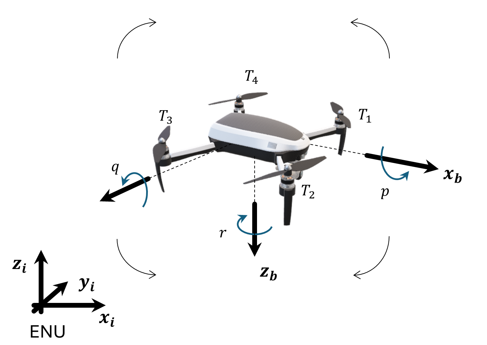
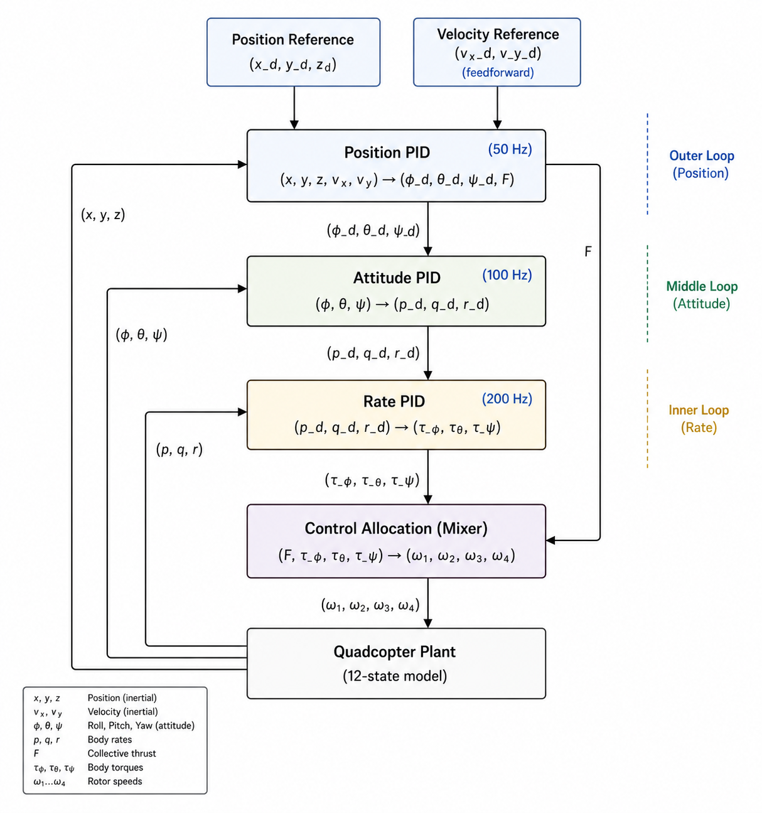
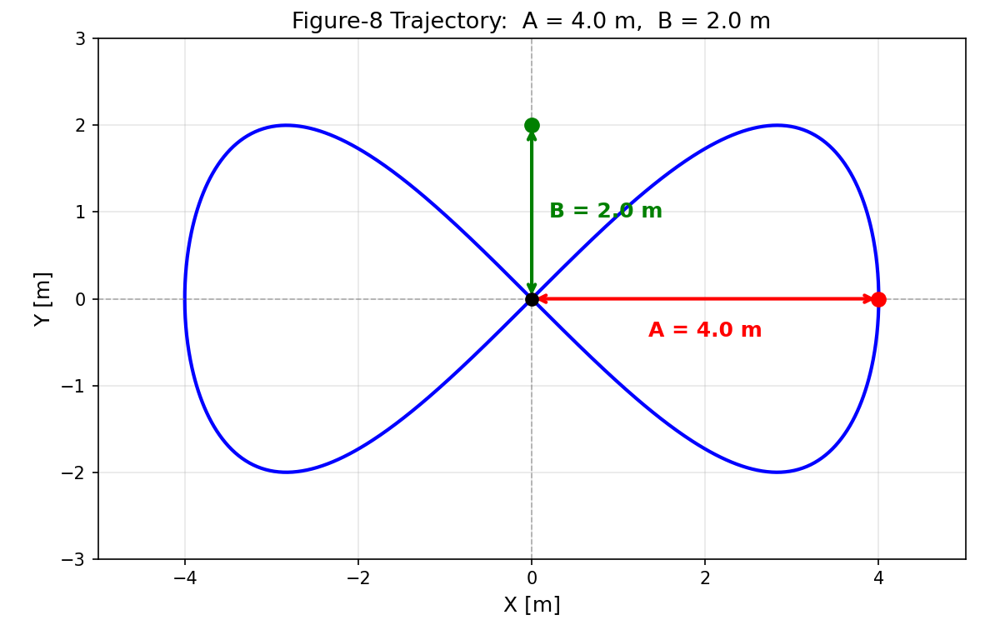
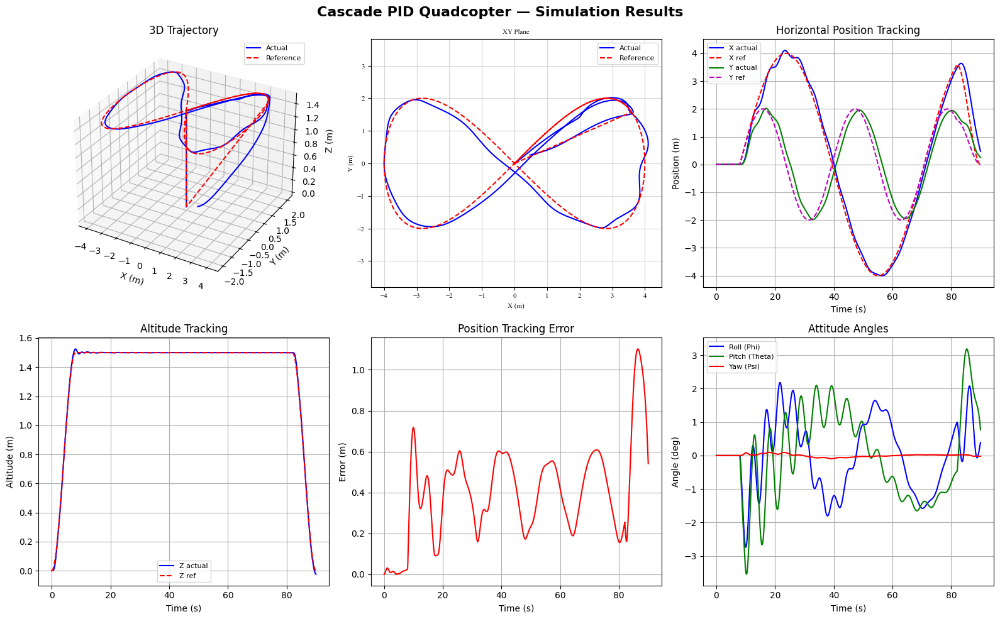

# Quadcopter Cascade PID Controller - Python

Nonlinear 6-DOF simulation of a quadcopter tracking a figure-8 trajectory using a 3-loop cascade PID controller.

---

## 🔗 Official Recognition
This implementation was accepted as an official example in the c4dynamics framework:**:
- [c4dynamics/pid_cascade](https://c4dynamics.github.io/c4dynamics/programs/pid_cascade/quadcopter_pid.html)

---

## Results

| Metric | Value |
|--------|-------|
| RMSE X | 0.199 m (5.0% of X amplitude) |
| RMSE Y | 0.383 m (19.2% of Y amplitude) |
| RMSE Z | 0.002 m (0.14% of altitude) |
| Max altitude deviation | 2.53 cm |

---

## Visualizations

### Vehicle Model & Reference Frame

### Control Architecture

### Figure-8 Reference Trajectory

### Simulation Results

---

## Quick Start

---

## 📁 Files
- `src/quad_pid_utils.py` - Dynamics, controllers, plotting, metrics
- `src/quadcopter_pid.ipynb` - Main simulation notebook
- `src/figures/` - Architecture and trajectory diagrams
